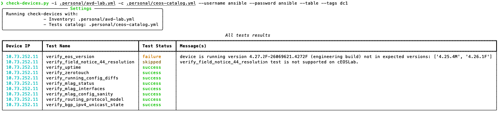

# Arista Network Test Automation (ANTA) Framework

This repository is a Python package to automate tests on Arista devices.

- The package name is [ANTA](./anta), which stands for **Arista Network Test Automation**.
- This package provides a set of tests to validate the state of your network.
- This package can be imported in Python scripts:
  - To automate NRFU (Network Ready For Use) test on a preproduction network
  - To automate tests on a live network (periodically or on demand)

This repository comes with a set of [scripts](./scripts) to run __Arista Network Test Automation__ (ANTA) framework

- `check-devices.py` is an easy to use script to test your network with ANTA.
- `collect-eos-commands.py` to collect commands output from devices
- `collect-sheduled-show-tech.py` to collect the scheduled show tech-support files from devices

</img>

In addition you have also some useful scripts to help around testing:

- `clear-counters.py` to clear counters on devices
- `evpn-blacklist-recovery.py` to clear the list of MAC addresses which are blacklisted in EVPN
- `create-devices-inventory-from-cvp.py`: Build inventory for scripts from Arista Cloudvision (CVP)

> Most of these scripts use eAPI (EOS API). You can find examples of EOS automation with eAPI in this [repository](https://github.com/arista-netdevops-community/arista_eos_automation_with_eAPI).

# Documentation

The documentation is published on [ANTA package website](https://arista-netdevops-community.github.io/network-test-automation/)

# Contribution guide

Contributions are welcome. Please refer to the [contribution guide](CONTRIBUTING.md)

# Credits

Thank you to [Angélique Phillipps](https://github.com/aphillipps), [Colin MacGiollaEáin](https://github.com/colinmacgiolla), [Khelil Sator](https://github.com/ksator), [Matthieu Tache](https://github.com/mtache), [Onur Gashi](https://github.com/onurgashi), [Paul Lavelle](https://github.com/paullavelle), [Guillaume Mulocher](https://github.com/gmuloc) and [Thomas Grimonet](https://github.com/titom73) for their contributions and guidances.
