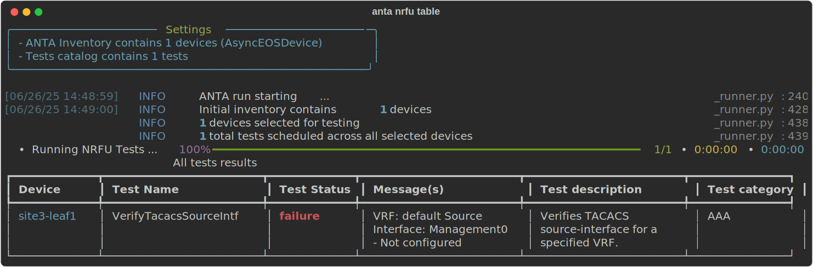
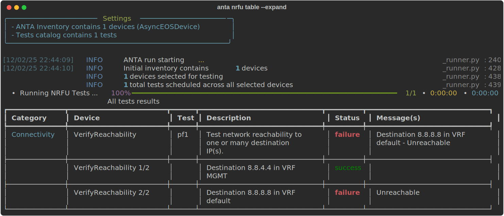

<!--
  ~ Copyright (c) 2023-2026 Arista Networks, Inc.
  ~ Use of this source code is governed by the Apache License 2.0
  ~ that can be found in the LICENSE file.
  -->

This section describes all the available tests provided by the ANTA package.

## Available Tests

Here are the tests that we currently provide:

- [AAA](tests/aaa.md)
- [Adaptive Virtual Topology](tests/avt.md)
- [BFD](tests/bfd.md)
- [Configuration](tests/configuration.md)
- [Connectivity](tests/connectivity.md)
- [CVX](tests/cvx.md)
- [EVPN](tests/evpn.md)
- [Field Notices](tests/field_notices.md)
- [Flow Tracking](tests/flow_tracking.md)
- [GreenT](tests/greent.md)
- [Hardware](tests/hardware.md)
- [Interfaces](tests/interfaces.md)
- [LANZ](tests/lanz.md)
- [Logging](tests/logging.md)
- [MLAG](tests/mlag.md)
- [Multicast](tests/multicast.md)
- [Profiles](tests/profiles.md)
- [PTP](tests/ptp.md)
- [Router Path Selection](tests/path_selection.md)
- [Routing Generic](tests/routing.generic.md)
- [Routing BGP](tests/routing.bgp.md)
- [Routing ISIS](tests/routing.isis.md)
- [Routing OSPF](tests/routing.ospf.md)
- [Security](tests/security.md)
- [Services](tests/services.md)
- [SNMP](tests/snmp.md)
- [Software](tests/software.md)
- [STP](tests/stp.md)
- [STUN](tests/stun.md)
- [System](tests/system.md)
- [VLAN](tests/vlan.md)
- [VXLAN](tests/vxlan.md)

!!! tip

    You can use `anta get tests` from the CLI to list all the tests available with an example. Refer to [documentation](../cli/get-tests.md) for more options.

## Using the Tests

All these tests can be imported in a [catalog](../usage-inventory-catalog.md) to be used by [the ANTA CLI](../cli/nrfu.md) or in your [own framework](../advanced_usages/as-python-lib.md).

## Atomic result support

Tests marked with the following badge in the documentation support **Atomic Results**: 

This means that when `anta nrfu <command>` is run with the `--expand` flag (currently supported for `table` and `text`), the report expands the test results to show one entry per input.

For instance, consider the following inventory and catalog:

```yaml title="inventory.yml"
---
anta_inventory:
  hosts:
    - host: 10.42.42.42
      name: pf1
```

```yaml title="catalog.yml"
---
anta.tests.connectivity:
  - VerifyReachability:
      hosts:
        - destination: 8.8.8.8
          vrf: MGMT
        - destination: 8.8.4.4
          vrf: default
```

**Normal Run:**

{ loading=lazy width="1600" }

**Expanded Run:**

{ loading=lazy width="1600" }

!!! warning

    If the command collection fails for any reason, the results for that test will not be expanded.
    This includes command collection failures based on [known EOS errors](./commands.md#anta.constants.KNOWN_EOS_ERRORS) tracked by ANTA.

!!! info

    If you would like a test to support atomic results, please [open an issue on GitHub](https://github.com/aristanetworks/anta/issues)
