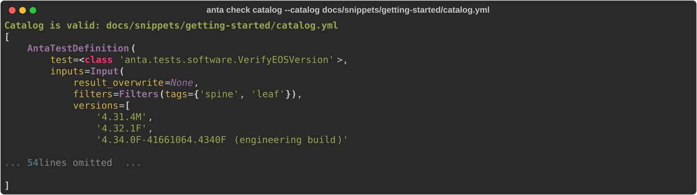

<!--
  ~ Copyright (c) 2023-2026 Arista Networks, Inc.
  ~ Use of this source code is governed by the Apache License 2.0
  ~ that can be found in the LICENSE file.
  -->

The ANTA check command allows you to execute some checks on the ANTA input files.
Only checking the catalog is currently supported.

```bash
--8<-- "anta_check_help.txt"
```

## Checking the catalog

```bash
--8<-- "anta_check_catalog_help.txt"
```

### Example

```bash
anta check catalog --catalog docs/snippets/getting-started/catalog.yml
```

{ class="img_center" loading=lazy width="1600" }
