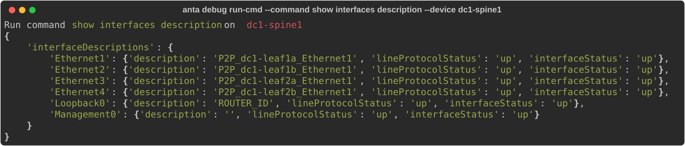
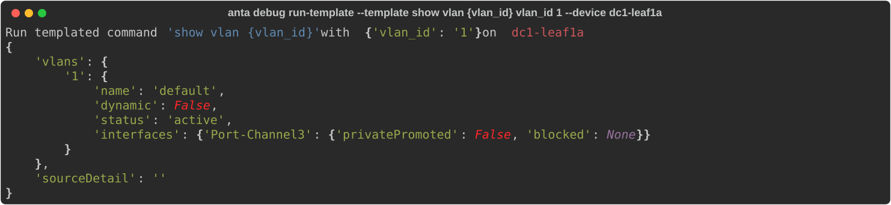
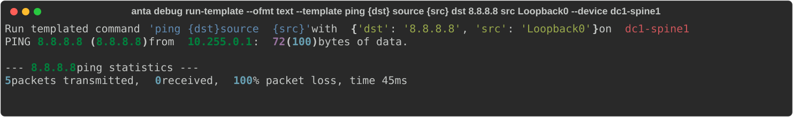
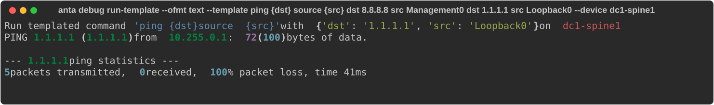

<!--
  ~ Copyright (c) 2023-2026 Arista Networks, Inc.
  ~ Use of this source code is governed by the Apache License 2.0
  ~ that can be found in the LICENSE file.
  -->

The ANTA CLI includes a set of debugging tools, making it easier to build and test ANTA content. This functionality is accessed via the `debug` subcommand and offers the following options:

- Executing a command on a device from your inventory and retrieving the result.
- Running a templated command on a device from your inventory and retrieving the result.

These tools are especially helpful in building the tests, as they give a visual access to the output received from the eAPI. They also facilitate the extraction of output content for use in unit tests, as described in our [contribution guide](../contribution.md).

!!! warning
    The `debug` tools require a device from your inventory. Thus, you must use a valid [ANTA Inventory](../usage-inventory-catalog.md#device-inventory).

## DEBUG command overview

```bash
--8<-- "anta_debug_help.txt"
```

## Executing an EOS command

You can use the `run-cmd` entrypoint to run a command, which includes the following options:

### Command overview

```bash
--8<-- "anta_debug_runcmd_help.txt"
```

!!! tip
    `username`, `password`, `enable-password`, `enable`, `timeout` and `insecure` values are the same for all devices

### Example

This example illustrates how to run the `show interfaces description` command with a `JSON` format (default):

```bash
anta debug run-cmd --command "show interfaces description" --device dc1-spine1
```

{ class="img_center" loading=lazy width="1600" }

## Executing an EOS command using templates

The `run-template` entrypoint allows the user to provide an [`f-string`](https://realpython.com/python-f-strings/#f-strings-a-new-and-improved-way-to-format-strings-in-python) templated command. It is followed by a list of arguments (key-value pairs) that build a dictionary used as template parameters.

### Command overview

```bash
--8<-- "anta_debug_runtemplate_help.txt"
```

> `username`, `password`, `enable-password`, `enable`, `timeout` and `insecure` values are the same for all devices

### Example

This example uses the `show vlan {vlan_id}` command in a `JSON` format:

```bash
anta debug run-template --template "show vlan {vlan_id}" vlan_id 1 --device dc1-leaf1a
```

{ class="img_center" loading=lazy width="1600" }

### Example of multiple arguments

!!! warning
    If multiple arguments of the same key are provided, only the last argument value will be kept in the template parameters.

```bash
anta debug run-template --ofmt text --template "ping {dst} source {src}" dst 8.8.8.8 src Loopback0 --device dc1-spine1
```

{ class="img_center" loading=lazy width="1600" }

When a parameter is repeated, only its final value is used:

```bash
anta debug run-template --ofmt text --template "ping {dst} source {src}" dst 8.8.8.8 src Management0 dst 1.1.1.1 src Loopback0 --device dc1-spine1
```

{ class="img_center" loading=lazy width="1600" }
