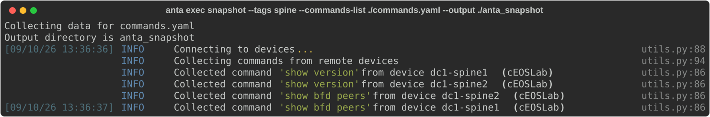
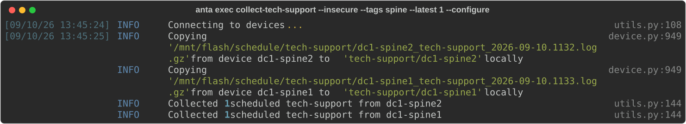

<!--
  ~ Copyright (c) 2023-2026 Arista Networks, Inc.
  ~ Use of this source code is governed by the Apache License 2.0
  ~ that can be found in the LICENSE file.
  -->

ANTA CLI provides a set of entrypoints to facilitate remote command execution on EOS devices.

## EXEC command overview

```bash
--8<-- "anta_exec_help.txt"
```

## Clear interfaces counters

This command clears interface counters on EOS devices specified in your inventory.

### Command overview

```bash
--8<-- "anta_exec_clearcounters_help.txt"
```

!!! tip
    `username`, `password`, `enable-password`, `enable`, `timeout` and `insecure` values are the same for all devices

### Example

```bash
anta exec clear-counters --tags spine
```

!!! warning
    This command changes operational state by clearing interface counters on the selected devices. Run it only when that is intended.

## Collect a set of commands

This command collects all the commands specified in a commands-list file, which can be in either `json` or `text` format.

### Command overview

```bash
--8<-- "anta_exec_snapshot_help.txt"
```

> `username`, `password`, `enable-password`, `enable`, `timeout` and `insecure` values are the same for all devices

The commands-list file should follow this structure:

```yaml
---
json_format:
  - show version
text_format:
  - show bfd peers
```

### Example

```bash
anta exec snapshot --tags spine --commands-list ./commands.yaml --output ./anta_snapshot
```

{ class="img_center" loading=lazy width="1600" }

The results of the executed commands will be stored in the output directory specified during command execution:

```bash
tree anta_snapshot
anta_snapshot
├── dc1-spine1
│   ├── json
│   │   └── show version.json
│   └── text
│       └── show bfd peers.log
└── dc1-spine2
    ├── json
    │   └── show version.json
    └── text
        └── show bfd peers.log

7 directories, 4 files
```

## Get Scheduled tech-support

EOS offers a feature that automatically creates a tech-support archive every hour by default. These archives are stored under `/mnt/flash/schedule/tech-support`.

```eos
leaf1#show schedule summary
Maximum concurrent jobs  1
Prepend host name to logfile: Yes
Name                 At Time       Last        Interval       Timeout        Max        Max     Logfile Location                  Status
                                   Time         (mins)        (mins)         Log        Logs
                                                                            Files       Size
----------------- ------------- ----------- -------------- ------------- ----------- ---------- --------------------------------- ------
tech-support           now         08:37          60            30           100         -      flash:schedule/tech-support/      Success


leaf1#bash ls /mnt/flash/schedule/tech-support
leaf1_tech-support_2023-03-09.1337.log.gz  leaf1_tech-support_2023-03-10.0837.log.gz  leaf1_tech-support_2023-03-11.0337.log.gz
```

For Network Readiness for Use (NRFU) tests and to keep a comprehensive report of the system state before going live, ANTA provides a command-line interface that efficiently retrieves these files.

### Command overview

```bash
--8<-- "anta_exec_collecttechsupport_help.txt"
```

!!! tip
    `username`, `password`, `enable-password`, `enable`, `timeout` and `insecure` values are the same for all devices

When executed, this command fetches tech-support files and downloads them locally into a device-specific subfolder within the designated folder. You can specify the output folder with the `--output` option.

ANTA uses SCP to download files from devices and will not trust unknown SSH hosts by default. Add the SSH public keys of your devices to your `known_hosts` file or use the `anta --insecure` option to ignore SSH host keys validation.

The configuration `aaa authorization exec default` must be present on devices to be able to use SCP.

!!! warning
    **Deprecation**

    ANTA can automatically configure `aaa authorization exec default local` using the `anta exec collect-tech-support --configure` option but this option is deprecated and will be removed in ANTA 2.0.0.

If you require specific AAA configuration for `aaa authorization exec default`, like `aaa authorization exec default none` or `aaa authorization exec default group tacacs+`, you will need to configure it manually.

The `--latest` option allows retrieval of a specific number of the most recent tech-support files.

!!! warning
    By default **all** the tech-support files present on the devices are retrieved.

### Example

```bash
anta exec collect-tech-support --insecure --tags spine --latest 1 --configure
```

The `--configure` option makes this example self-contained by adding the required AAA authorization configuration when it is missing. As noted above, this option is deprecated and changes the device configuration.

{ class="img_center" loading=lazy width="1600" }

After a successful collection, the output folder structure is as follows:

```bash
tree tech-support/
tech-support/
├── dc1-spine1
│   └── dc1-spine1_tech-support_<date>.<time>.log.gz
└── dc1-spine2
    └── dc1-spine2_tech-support_<date>.<time>.log.gz

3 directories, 2 files
```

Each device has its own subdirectory containing the collected tech-support files.
