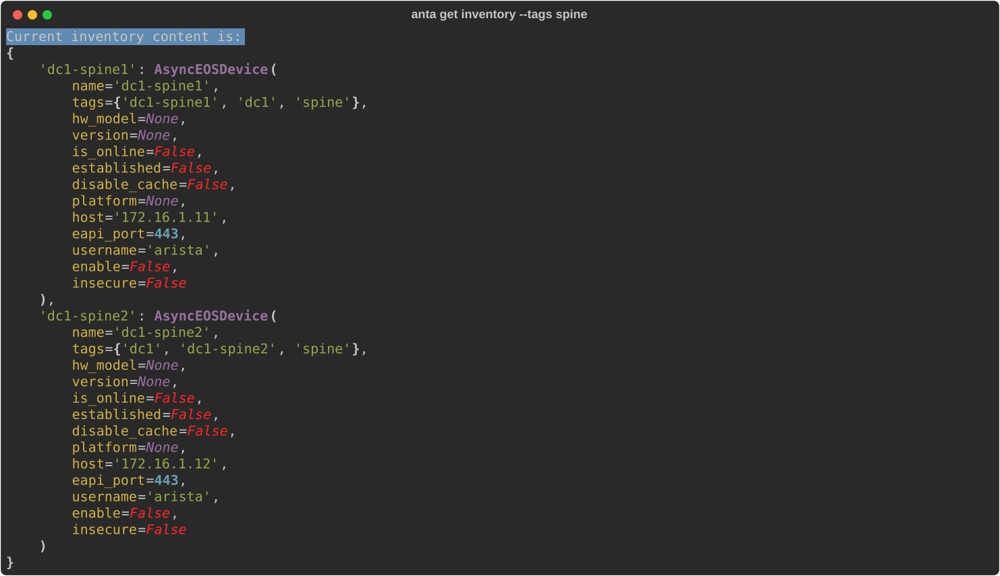

<!--
  ~ Copyright (c) 2023-2026 Arista Networks, Inc.
  ~ Use of this source code is governed by the Apache License 2.0
  ~ that can be found in the LICENSE file.
  -->

The ANTA CLI offers multiple commands to access data from your local inventory.

## List devices in inventory

This command will list all devices available in the inventory. Using the `--tags` option, you can filter this list to only include devices with specific tags (visit [this page](tag-management.md) to learn more about tags). The `--connected` option allows you to display only the devices where a connection has been established.

### Command overview

```bash
--8<-- "anta_get_inventory_help.txt"
```

!!! tip
    By default, `anta get inventory` only provides information that doesn't rely on a device connection. If you are interested in obtaining connection-dependent details, like the hardware model, use the `--connected` option.

### Example

Let's consider the following inventory:

```yaml title="inventory.yml"
--8<-- "getting-started/inventory.yml"
```

To retrieve a comprehensive list of all devices matching the `spine` tag along with their details, execute the following command. The output contains the data loaded for those devices from your [inventory file](../usage-inventory-catalog.md).

```bash
anta get inventory --tags spine
```

{ class="img_center" loading=lazy width="1600" }
