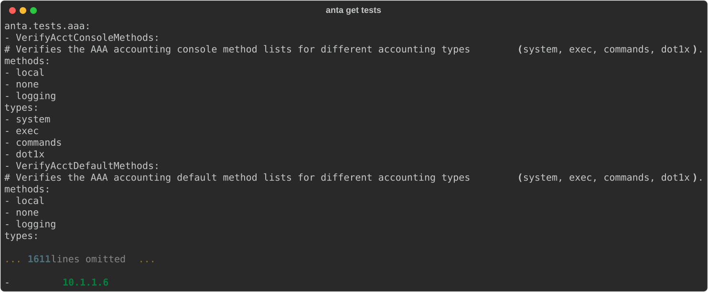
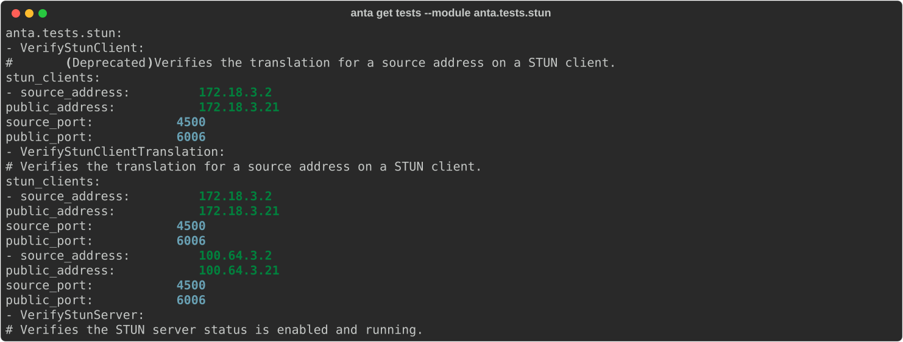
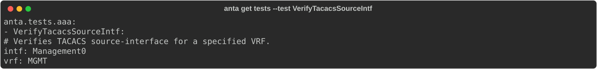
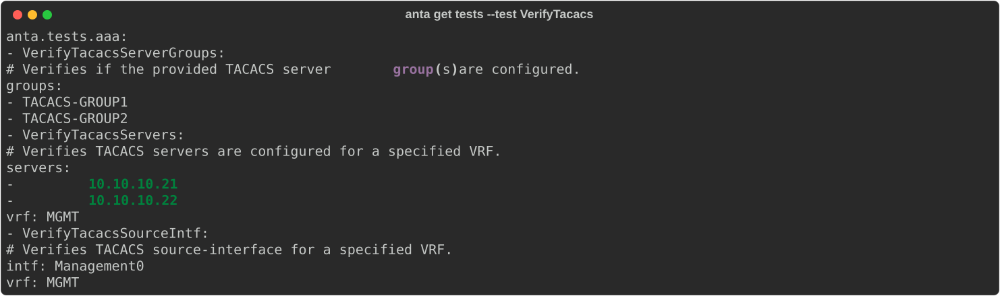
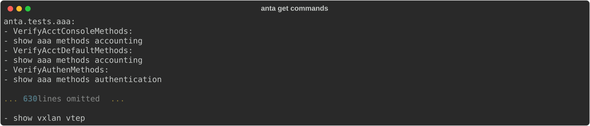
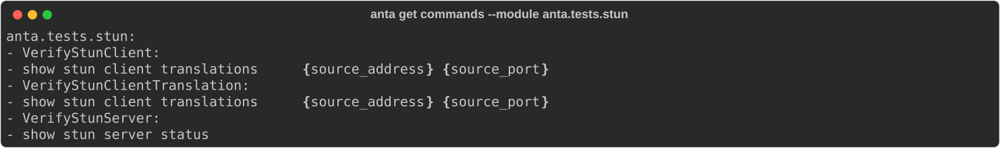
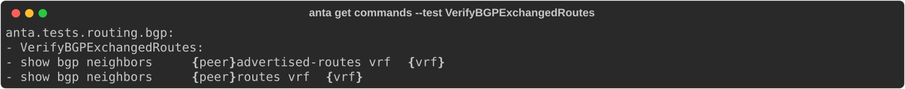
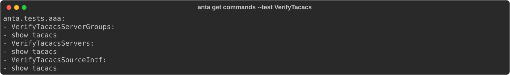
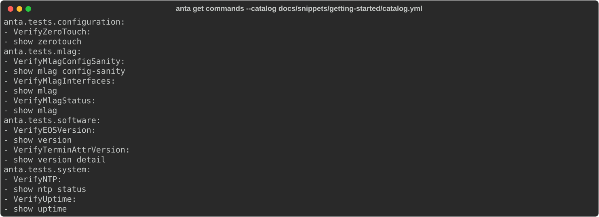
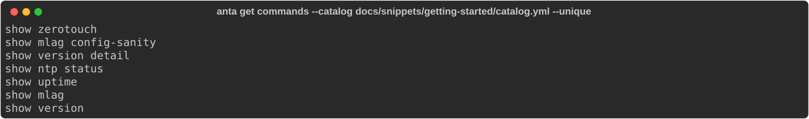

<!--
  ~ Copyright (c) 2023-2026 Arista Networks, Inc.
  ~ Use of this source code is governed by the Apache License 2.0
  ~ that can be found in the LICENSE file.
  -->

## `anta get tests`

`anta get tests` helps you discover tests and render catalog examples from their
documentation. The default, broad `anta.tests` discovery omits security advisory
tests because they are normally selected from the built-in catalog with
[`anta psirt`](../security-advisory/usage.md). To inspect their catalog examples
explicitly, use `--module anta.tests.advisories`.

### Command overview

```bash
--8<-- "anta_get_tests_help.txt"
```

!!! tip
    By default, `anta get tests` retrieves every non-advisory test available in ANTA. Security advisory tests are rendered only when the requested module is `anta.tests.advisories` or one of its submodules.

### Examples

#### Default usage

```bash
anta get tests
```

{ class="img_center" loading=lazy width="1600" }

#### Filtering using `--module`

To retrieve all the tests from `anta.tests.stun`:

```bash
anta get tests --module anta.tests.stun
```

{ class="img_center" loading=lazy width="1600" }

#### Filtering using `--test`

```bash
anta get tests --test VerifyTacacsSourceIntf
```

{ class="img_center" loading=lazy width="1600" }

!!! tip
    You can filter tests by providing a prefix - ANTA will return all tests that start with your specified string.

```bash
anta get tests --test VerifyTacacs
```

{ class="img_center" loading=lazy width="1600" }

#### Count the tests

```bash
anta get tests --count
```

{ class="img_center" loading=lazy width="1600" }

## `anta get commands`

`anta get commands` returns the EOS commands used by the targeted tests. Unlike
`anta get tests`, this command includes security advisory tests so operators can
identify every EOS command ANTA may execute.

### Command overview

```bash
--8<-- "anta_get_commands_help.txt"
```

!!! tip
    By default, `anta get commands` retrieves commands from all built-in tests, including security advisory tests. Use `--module anta.tests.advisories` to show only advisory commands.

### Examples

#### Default usage

```bash
anta get commands
```

{ class="img_center" loading=lazy width="1600" }

#### Filtering using `--module`

To retrieve all the commands from the tests in `anta.tests.stun`:

```bash
anta get commands --module anta.tests.stun
```

{ class="img_center" loading=lazy width="1600" }

#### Filtering using `--test`

```bash
anta get commands --test VerifyBGPExchangedRoutes
```

{ class="img_center" loading=lazy width="1600" }

!!! tip
    You can filter tests by providing a prefix - ANTA will return all tests that start with your specified string.

```bash
anta get commands --test VerifyTacacs
```

{ class="img_center" loading=lazy width="1600" }

#### Filtering using `--catalog`

To retrieve all the commands from the tests in the [Getting Started catalog](../getting-started.md#test-catalog):

```bash
anta get commands --catalog docs/snippets/getting-started/catalog.yml
```

{ class="img_center" loading=lazy width="1600" }

#### Output using `--unique`

Using the `--unique` flag will output only the list of unique commands that will be run which can be useful to configure a AAA system.

For instance, with the previous catalog:

```bash
anta get commands --catalog docs/snippets/getting-started/catalog.yml --unique
```

{ class="img_center" loading=lazy width="1600" }
