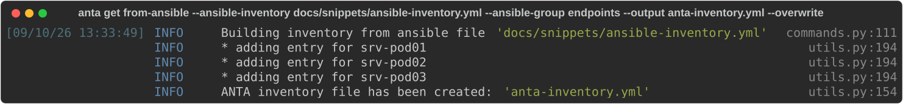

<!--
  ~ Copyright (c) 2023-2026 Arista Networks, Inc.
  ~ Use of this source code is governed by the Apache License 2.0
  ~ that can be found in the LICENSE file.
  -->

In large setups, it might be beneficial to construct your inventory based on your Ansible inventory. The `from-ansible` entrypoint of the `get` command enables the user to create an ANTA inventory from Ansible.

## Command overview

```bash
--8<-- "anta_get_fromansible_help.txt"
```

!!! warning

    - `anta get from-ansible` does not support inline vaulted variables, comment them out to generate your inventory.

    - If the vaulted variable is necessary to build the inventory (e.g. `ansible_host`), it needs to be unvaulted for `from-ansible` command to work.

    - The current implementation only considers devices directly attached to a specific Ansible group and does not support inheritance when using the `--ansible-group` option.

The output path is required, either through `--output` or `ANTA_INVENTORY`. If the destination file contains data, ANTA asks for confirmation in an interactive terminal. Use `--overwrite` for intentional, non-interactive replacement.

## Example

The example uses the following Ansible inventory. Each `ansible_host` becomes the ANTA `host`, while the Ansible host key becomes its `name`:

```yaml
--8<-- "ansible-inventory.yml"
```

Run the conversion against the `endpoints` group:

```bash
anta get from-ansible --ansible-inventory docs/snippets/ansible-inventory.yml --ansible-group endpoints --output anta-inventory.yml --overwrite
```

{ class="img_center" loading=lazy width="1600" }

The generated `anta-inventory.yml` contains:

```yaml
--8<-- "anta-inventory-from-ansible.yml"
```
