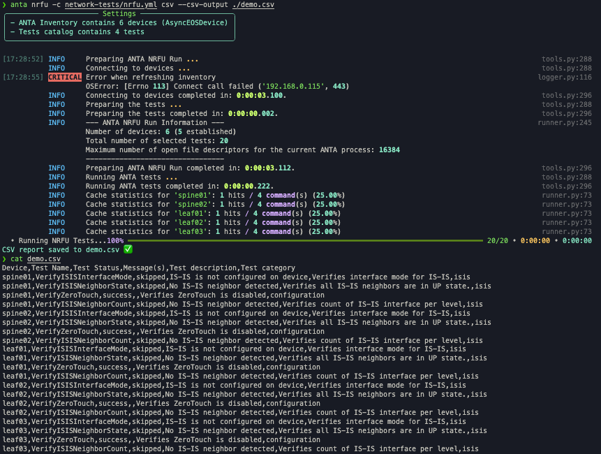
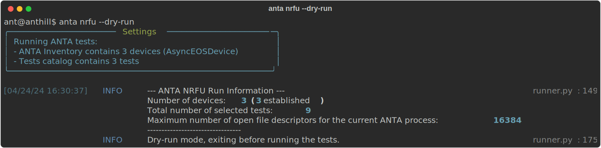

<!--
  ~ Copyright (c) 2023-2024 Arista Networks, Inc.
  ~ Use of this source code is governed by the Apache License 2.0
  ~ that can be found in the LICENSE file.
  -->

# Execute Network Readiness For Use (NRFU) Testing

ANTA provides a set of commands for performing NRFU tests on devices. These commands are under the `anta nrfu` namespace and offer multiple output format options:

- [Text view](#performing-nrfu-with-text-rendering)
- [Table view](#performing-nrfu-with-table-rendering)
- [JSON view](#performing-nrfu-with-json-rendering)
- [Custom template view](#performing-nrfu-with-custom-reports)

## NRFU Command overview

```bash
--8<-- "anta_nrfu_help.txt"
```

> `username`, `password`, `enable-password`, `enable`, `timeout` and `insecure` values are the same for all devices

All commands under the `anta nrfu` namespace require a catalog yaml file specified with the `--catalog` option and a device inventory file specified with the `--inventory` option.

!!! info
    Issuing the command `anta nrfu` will run `anta nrfu table` without any option.

### Tag management

The `--tags` option can be used to target specific devices in your inventory and run only tests configured with this specific tags from your catalog. The default tag is set to `all` and is implicit. Expected behaviour is provided below:

| Command | Description |
| ------- | ----------- |
| `none` | Run all tests on all devices according `tag` definition in your inventory and test catalog. And tests with no tag are executed on all devices|
| `--tags leaf` | Run all tests marked with `leaf` tag on all devices configured with `leaf` tag.<br/> All other tags are ignored |
| `--tags leaf,spine` | Run all tests marked with `leaf` tag on all devices configured with `leaf` tag.<br/>Run all tests marked with `spine` tag on all devices configured with `spine` tag.<br/> All other tags are ignored |

!!! info
    [More examples](tag-management.md) available on this dedicated page.

### Device and test filtering

Options `--device` and `--test` can be used to target one or multiple devices and/or tests to run in your environment. The options can be repeated. Example: `anta nrfu --device leaf1a --device leaf1b --test VerifyUptime --test VerifyReloadCause`.

### Hide results

Option `--hide` can be used to hide test results in the output based on their status. The option can be repeated. Example: `anta nrfu --hide error --hide skipped`.

## Performing NRFU with text rendering

The `text` subcommand provides a straightforward text report for each test executed on all devices in your inventory.

### Command overview

```bash
Usage: anta nrfu text [OPTIONS]

  ANTA command to check network states with text result.

Options:
  --help  Show this message and exit.
```

### Example

```bash
anta nrfu --device DC1-LEAF1A text
```
{ loading=lazy width="1600" }

## Performing NRFU with table rendering

The `table` command under the `anta nrfu` namespace offers a clear and organized table view of the test results, suitable for filtering. It also has its own set of options for better control over the output.

### Command overview

```bash
Usage: anta nrfu table [OPTIONS]

  ANTA command to check network states with table result.

Options:
  --group-by [device|test]  Group result by test or device.
  --help                    Show this message and exit.
```

The `--group-by` option show a summarized view of the test results per host or per test.

### Examples

```bash
anta nrfu --tags LEAF table
```
{ loading=lazy width="1600" }

For larger setups, you can also group the results by host or test to get a summarized view:

```bash
anta nrfu table --group-by device
```
{ loading=lazy width="1600" }

```bash
anta nrfu table --group-by test
```
{ loading=lazy width="1600" }

To get more specific information, it is possible to filter on a single device or a single test:

```bash
anta nrfu --device spine1 table
```
{ loading=lazy width="1600" }

```bash
anta nrfu --test VerifyZeroTouch table
```
{ loading=lazy width="1600" }

## Performing NRFU with JSON rendering

The JSON rendering command in NRFU testing is useful in generating a JSON output that can subsequently be passed on to another tool for reporting purposes.

### Command overview

```bash
anta nrfu json --help
Usage: anta nrfu json [OPTIONS]

  ANTA command to check network state with JSON result.

Options:
  -o, --output FILE  Path to save report as a file  [env var:
                     ANTA_NRFU_JSON_OUTPUT]
  --help             Show this message and exit.
```

The `--output` option allows you to save the JSON report as a file.

### Example

```bash
anta nrfu --tags LEAF json
```
{ loading=lazy width="1600" }

## Performing NRFU with saving results in CSV file.

The `csv` command in NRFU testing is useful in generating a CSV file with all tests result that can be analyzed, filtered by operator for reporting purposes.

### Command overview

```bash
anta nrfu csv --help
Usage: anta nrfu csv [OPTIONS]

  ANTA command to check network states with CSV result.

Options:
  --csv-output FILE  Path to save report as a CSV file. It only saves test
                     results and not the output from --group-by option  [env
                     var: ANTA_NRFU_CSV_CSV_OUTPUT]
  --help             Show this message and exit.
```

### Example

{ loading=lazy width="1600" }

## Performing NRFU with custom reports

ANTA offers a CLI option for creating custom reports. This leverages the Jinja2 template system, allowing you to tailor reports to your specific needs.

### Command overview

```bash
anta nrfu tpl-report --help
Usage: anta nrfu tpl-report [OPTIONS]

  ANTA command to check network state with templated report

Options:
  -tpl, --template FILE  Path to the template to use for the report  [env var:
                         ANTA_NRFU_TPL_REPORT_TEMPLATE; required]
  -o, --output FILE      Path to save report as a file  [env var:
                         ANTA_NRFU_TPL_REPORT_OUTPUT]
  --help                 Show this message and exit.
```
The `--template` option is used to specify the Jinja2 template file for generating the custom report.

The `--output` option allows you to choose the path where the final report will be saved.

### Example

```bash
anta nrfu --tags LEAF tpl-report --template ./custom_template.j2
```
{ loading=lazy width="1600" }

The template `./custom_template.j2` is a simple Jinja2 template:

```j2

* {{ d.test }} is [green]{{ d.result | upper}}[/green] for {{ d.name }}

```

The Jinja2 template has access to all `TestResult` elements and their values, as described in this [documentation](../api/result_manager_models.md#testresult-entry).

You can also save the report result to a file using the `--output` option:

```bash
anta nrfu --tags LEAF tpl-report --template ./custom_template.j2 --output nrfu-tpl-report.txt
```

The resulting output might look like this:

```bash
cat nrfu-tpl-report.txt
* VerifyMlagStatus is [green]SUCCESS[/green] for DC1-LEAF1A
* VerifyMlagInterfaces is [green]SUCCESS[/green] for DC1-LEAF1A
* VerifyMlagConfigSanity is [green]SUCCESS[/green] for DC1-LEAF1A
* VerifyMlagReloadDelay is [green]SUCCESS[/green] for DC1-LEAF1A
```

## Dry-run mode

It is possible to run `anta nrfu --dry-run` to execute ANTA up to the point where it should communicate with the network to execute the tests. When using `--dry-run`, all inventory devices are assumed to be online. This can be useful to check how many tests would be run using the catalog and inventory.

{ loading=lazy width="1600" }
