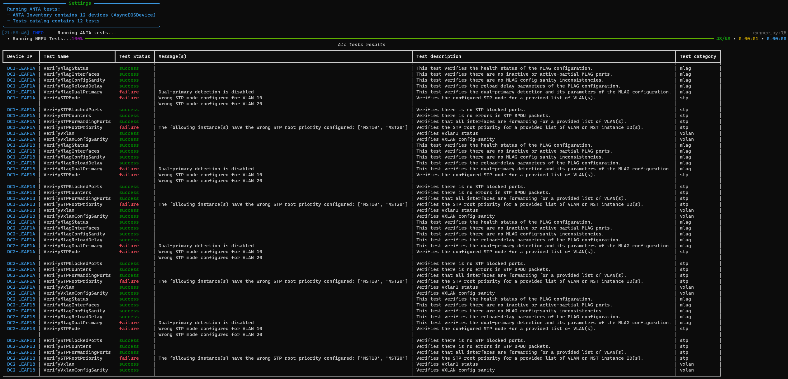

# Execute NRFU testing

All the NRFU testing commands are placed under `anta nrfu` and provide different rendering options:

- Table view
- JSON view
- Text view
- Custom template view

```bash
anta nrfu
Usage: anta nrfu [OPTIONS] COMMAND [ARGS]...

  Run NRFU against inventory devices

Options:
  --help  Show this message and exit.

Commands:
  json        ANTA command to check network state with JSON result
  table       ANTA command to check network states with table result
  text        ANTA command to check network states with text result
  tpl-report  ANTA command to check network state with templated report
```

All of these commands require the following input:

- A path to a catalog of tests to execute (`--catalog`)
- A list of tags if they are part of your inventory (`--tags`). List is comma separated


## NRFU with text rendering

This rendering is a pure text report for every test run on all devices. It comes with some options:

- Search (`--search`) for a regexp pattern in hostname and test name
- Option to skip (`--skip-error`) tests in error (not failure) because of a connectivity issue or unsupported command

Example output

```bash
$ anta nrfu text --tags pod1 --catalog nrfu/leaf.yml
leaf2 :: VerifyMlagStatus :: SUCCESS
leaf2 :: VerifyMlagInterface :: SUCCESS
leaf2 :: VerifyMlagConfigSanity :: SUCCESS
leaf2 :: VerifyInterfaceUtilization :: SUCCESS
leaf2 :: VerifyInterfaceErrors :: SUCCESS
leaf2 :: VerifyInterfaceDiscards :: SUCCESS
leaf2 :: VerifyInterfaceErrDisabled :: SUCCESS
leaf2 :: VerifyInterfaceStatus :: SUCCESS
leaf2 :: VerifyStormControlDrop :: SKIPPED (VerifyStormControlDrop test is not supported on cEOSLab.)
leaf2 :: VerifyPortChannel :: SUCCESS
leaf2 :: VerifyIllegalLacp :: SUCCESS
leaf2 :: VerifyLoopbackCount :: FAILURE (Found 3 Loopbacks when expecting 2)
leaf2 :: VerifySvi :: SUCCESS
[...]
```

## NRFU with table report

This rendering prints results in a nice table supporting grep filtering. It comes with its own set of options:

- Search (`--search`) for a pattern in hostname and test name.
- Option to group (`--group-by`) and summarize results. You can group by `host` or `test`.

```bash
$ anta check table -t pod1 -c nrfu/cudi.yml
```

{ loading=lazy width="800" }

You can also group per host or per test to get a summary view in case of large setup

{ loading=lazy width="800" }

## NRFU with JSON output

This command is helpful to generate a JSON and then pass it to another tool for reporting for instance. Only one option is available to save output to a file (`--output`)

```bash
$ anta check json -t pod1 -c nrfu/leaf.yml
[
  {
    "name": "leaf01",
    "test": "VerifyZeroTouch",
    "test_category": [
      "configuration"
    ],
    "test_description": "Verifies ZeroTouch is disabled.",
    "result": "success",
    "messages": []
  },
  {
    "name": "leaf01",
    "test": "VerifyRunningConfigDiffs",
    "test_category": [
      "configuration"
    ],
    "test_description": "",
    "result": "success",
    "messages": []
  },
]
```

## NRFU with your own report

Because you may want to have a specific report format, ANTA provides a CLI option to build report based on Jinja2 template.

```bash
$ anta nrfu tpl-report -c .personal/catalog-class.yml -tpl .personal/test_template.j2
╭───────────────────────── Settings ─────────────────────────╮
│ Running check-devices with:                                │
│               - Inventory: .personal/inventory_atd.yml     │
│               - Tests catalog: .personal/catalog-class.yml │
│               - Template: .personal/test_template.j2       │
╰────────────────────────────────────────────────────────────╯
* VerifyZeroTouch is SUCCESS for spine01
* VerifyRunningConfigDiffs is SUCCESS for spine01
* VerifyInterfaceUtilization is SUCCESS for spine01
```

And the template `.personal/test_template.j2` is a pure Jinja2 template:

```j2
$ cat .personal/test_template.j2

* {{ d.test }} is [green]{{ d.result | upper}}[/green] for {{ d.name }}

```

In this context, Jinja2 template can access to all `TestResult` elements with their values as described in [this documentation](../api/result_manager_models.md#testresult-entry).

An option is available to save the generated report into a text file:

```bash
# Run ANTA
$ anta nrfu tpl-report -c .personal/catalog-class.yml -tpl .personal/test_template.j2 -o .personal/demo.txt
╭───────────────────────── Settings ─────────────────────────╮
│ Running check-devices with:                                │
│               - Inventory: .personal/inventory_atd.yml     │
│               - Tests catalog: .personal/catalog-class.yml │
│               - Template: .personal/test_template.j2       │
╰────────────────────────────────────────────────────────────╯
* VerifyZeroTouch is SUCCESS for spine01
* VerifyRunningConfigDiffs is SUCCESS for spine01
* VerifyInterfaceUtilization is SUCCESS for spine01

# Display saved report
$ cat .personal/demo.txt
* VerifyZeroTouch is [green]SUCCESS[/green] for spine01
* VerifyRunningConfigDiffs is [green]SUCCESS[/green] for spine01
* VerifyInterfaceUtilization is [green]SUCCESS[/green] for spine01
```