<!--
  ~ Copyright (c) 2023-2026 Arista Networks, Inc.
  ~ Use of this source code is governed by the Apache License 2.0
  ~ that can be found in the LICENSE file.
  -->

ANTA provides a set of commands for performing NRFU tests on devices. These commands are under the `anta nrfu` namespace and offer multiple output format options:

- [Text report](#performing-nrfu-with-text-rendering)
- [Table report](#performing-nrfu-with-table-rendering)
- [JSON report](#performing-nrfu-with-json-rendering)
- [Custom template report](#performing-nrfu-with-custom-reports)
- [CSV report](#performing-nrfu-and-saving-results-in-a-csv-file)
- [Markdown report](#performing-nrfu-and-saving-results-in-a-markdown-file)

See [ANTA Test Reports](../reports/anta.md) for help choosing a format and for the corresponding Python reporter APIs.

## NRFU Command overview

```bash
--8<-- "anta_nrfu_help.txt"
```

> `username`, `password`, `enable-password`, `enable`, `timeout` and `insecure` values are the same for all devices

All commands under the `anta nrfu` namespace require a catalog yaml file specified with the `--catalog` option and a device inventory file specified with the `--inventory` option.

!!! tip
    Issuing the command `anta nrfu` will run `anta nrfu table` without any option.

### Tag management

The `--tags` option can be used to target specific devices in your inventory and run only tests configured with this specific tags from your catalog. Refer to the [dedicated page](tag-management.md) for more information.

### Device and test filtering

Options `--device` and `--test` can be used to target one or multiple devices and/or tests to run in your environment. The options can be repeated. Example: `anta nrfu --device leaf1a --device leaf1b --test VerifyUptime --test VerifyReloadCause`.

### Hide results

Option `--hide` can be used to hide test results in the output or report file based on their status. The option can be repeated. Example: `anta nrfu --hide error --hide skipped`.

## Performing NRFU with text rendering

The `text` subcommand provides a straightforward text report for each test executed on all devices in your inventory.

### Command overview

```bash
--8<-- "anta_nrfu_text_help.txt"
```

### Example

```bash
anta nrfu --device dc1-leaf1a text
```

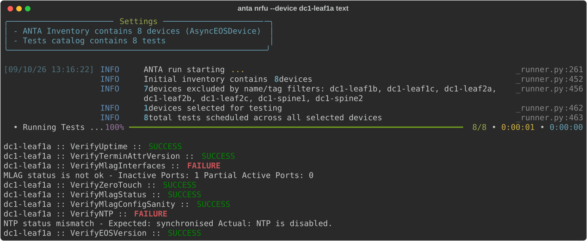{ class="img_center" loading=lazy width="1600" }

## Performing NRFU with table rendering

The `table` command under the `anta nrfu` namespace offers a clear and organized table view of the test results, suitable for filtering. It also has its own set of options for better control over the output.

### Command overview

```bash
--8<-- "anta_nrfu_table_help.txt"
```

The `--group-by` option shows a summarized view of the test results per host or per test.

### Examples

```bash
anta nrfu --tags leaf table
```

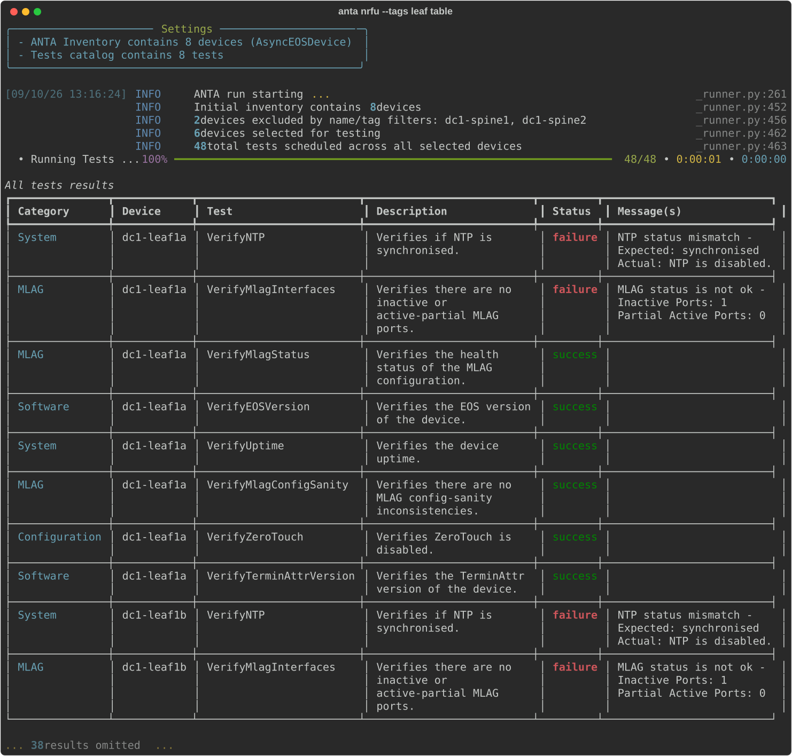{ class="img_center" loading=lazy width="1600" }

For larger setups, you can also group the results by host or test to get a summarized view:

```bash
anta nrfu table --group-by device
```

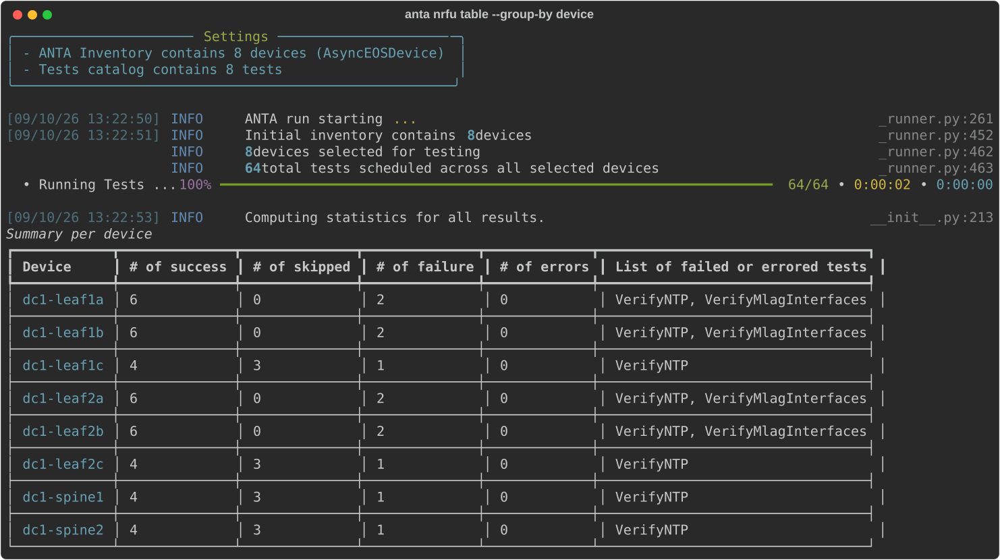{ class="img_center" loading=lazy width="1600" }

```bash
anta nrfu table --group-by test
```

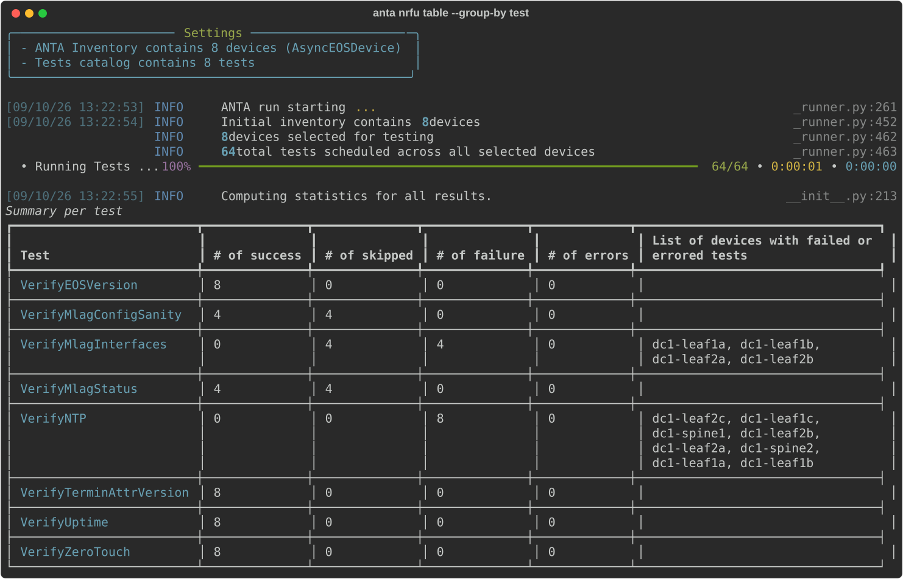{ class="img_center" loading=lazy width="1600" }

To get more specific information, it is possible to filter on a single device or a single test:

```bash
anta nrfu --device dc1-spine1 table
```

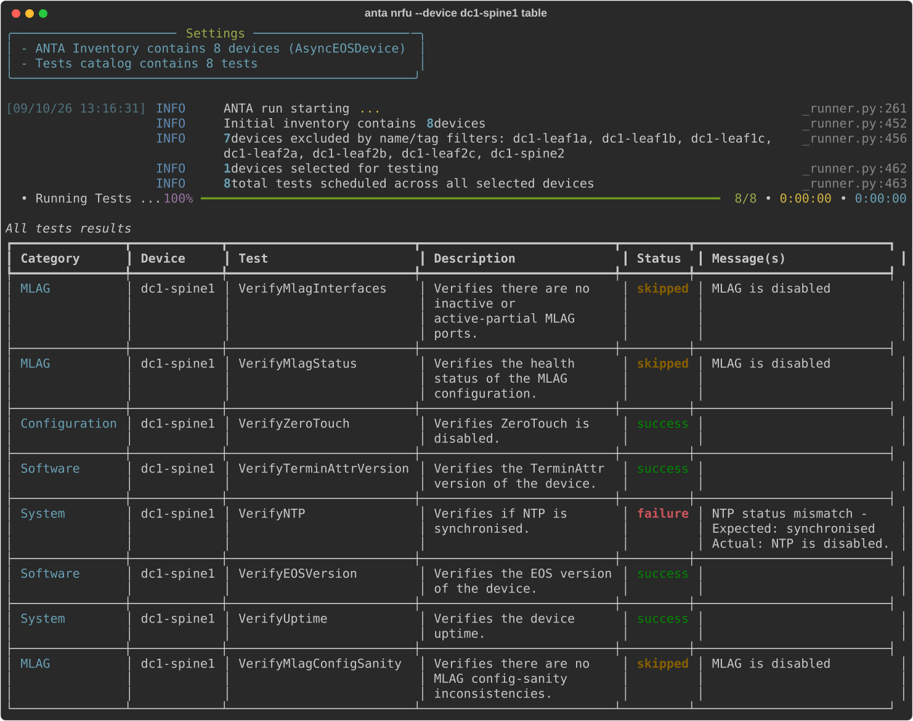{ class="img_center" loading=lazy width="1600" }

```bash
anta nrfu --test VerifyZeroTouch table
```

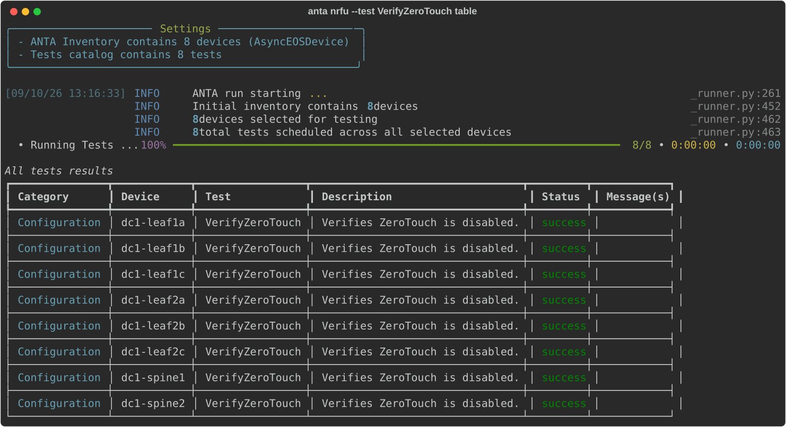{ class="img_center" loading=lazy width="1600" }

## Performing NRFU with JSON rendering

The JSON rendering command in NRFU testing will generate an output of all test results in JSON format.

### Command overview

```bash
--8<-- "anta_nrfu_json_help.txt"
```

The `--output` option allows you to save the JSON report as a file. If specified, no output will be displayed in the terminal. This is useful for further processing or integration with other tools.

### Example

```bash
anta nrfu --tags leaf json
```

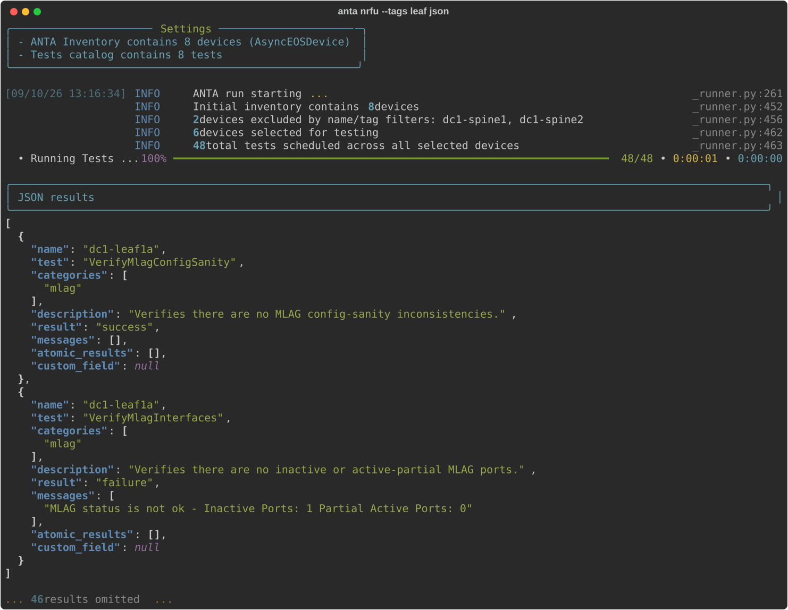{ class="img_center" loading=lazy width="1600" }

## Performing NRFU and saving results in a CSV file

The `csv` command in NRFU testing is useful for generating a CSV file with all tests result. This file can be easily analyzed and filtered by operator for reporting purposes.

### Command overview

```bash
--8<-- "anta_nrfu_csv_help.txt"
```

### Example

```bash
anta nrfu --tags leaf csv --csv-output nrfu.csv
```

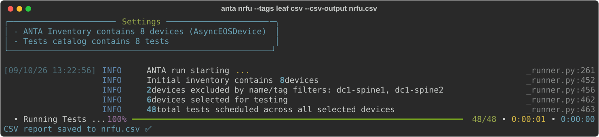{ class="img_center" loading=lazy width="1600" }

## Performing NRFU and saving results in a Markdown file

The `md-report` command in NRFU testing generates a comprehensive Markdown report containing various sections, including detailed statistics for devices and test categories.

### Command overview

```bash
--8<-- "anta_nrfu_mdreport_help.txt"
```

### Example

```bash
anta nrfu --tags leaf md-report --md-output nrfu.md
```

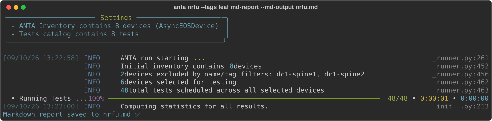{ class="img_center" loading=lazy width="1600" }

## Performing NRFU with custom reports

ANTA offers a CLI option for creating custom reports. This leverages the Jinja2 template system, allowing you to tailor reports to your specific needs.

### Command overview

```bash
--8<-- "anta_nrfu_tplreport_help.txt"
```

The `--template` option is used to specify the Jinja2 template file for generating the custom report.

The `--output` option allows you to choose the path where the final report will be saved.

### Example

```bash
anta nrfu --tags leaf tpl-report --template ./custom_template.j2
```

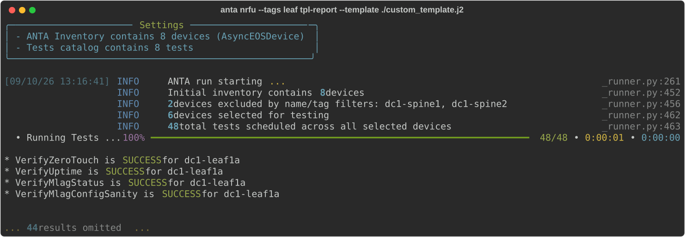{ class="img_center" loading=lazy width="1600" }

The template `./custom_template.j2` is a simple Jinja2 template:

```j2

* {{ d.test }} is [green]{{ d.result | upper }}[/green] for {{ d.name }}

```

The Jinja2 template has access to all `TestResult` elements and their values, as described in this [documentation](../api/result.md#anta.result_manager.models.TestResult).

You can also save the report result to a file using the `--output` option:

```bash
anta nrfu --tags leaf tpl-report --template ./custom_template.j2 --output nrfu-tpl-report.txt
```

An excerpt of the resulting file might look like this:

```bash
cat nrfu-tpl-report.txt
* VerifyMlagInterfaces is [green]FAILURE[/green] for dc1-leaf1a
* VerifyEOSVersion is [green]SUCCESS[/green] for dc1-leaf1a
* VerifyMlagConfigSanity is [green]SUCCESS[/green] for dc1-leaf1a
* VerifyUptime is [green]SUCCESS[/green] for dc1-leaf1a
... 44 results omitted ...
```

## Dry-run mode

It is possible to run `anta nrfu --dry-run` to execute ANTA up to the point where it should communicate with the network to execute the tests. When using `--dry-run`, all inventory devices are assumed to be online. This can be useful to check how many tests would be run using the catalog and inventory.

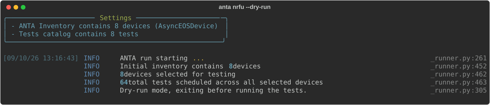{ class="img_center" loading=lazy width="1600" }
