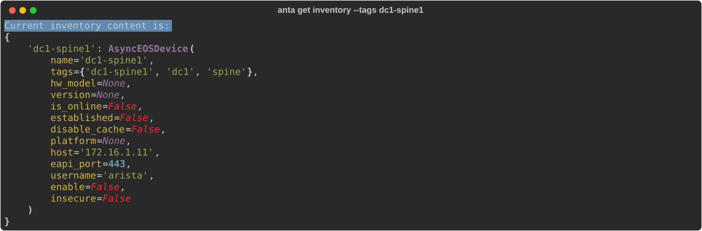
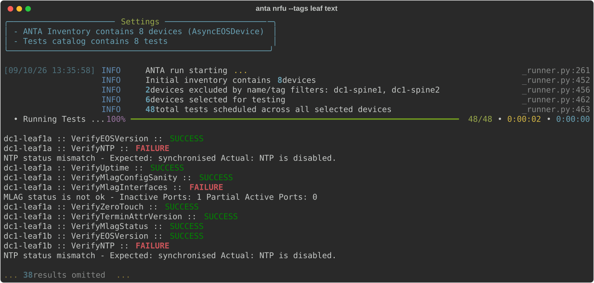
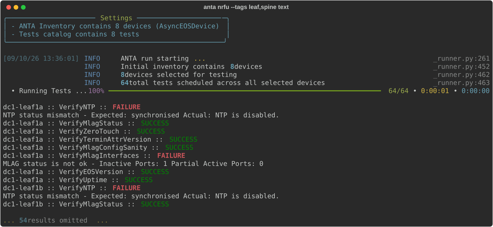
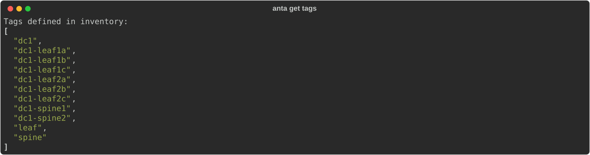

<!--
  ~ Copyright (c) 2023-2026 Arista Networks, Inc.
  ~ Use of this source code is governed by the Apache License 2.0
  ~ that can be found in the LICENSE file.
  -->

ANTA uses tags to define test-to-device mappings (tests run on devices with matching tags) and the `--tags` CLI option acts as a filter to execute specific test/device combinations.

## Defining tags

### Device tags

Device tags can be defined in the inventory:

```yaml title="inventory.yml"
--8<-- "getting-started/inventory.yml"
```

Each device also has its own name automatically added as a tag:

```bash
anta get inventory --tags dc1-spine1
```

{ class="img_center" loading=lazy width="1600" }

### Test tags

Tags can be defined in the test catalog to restrict tests to tagged devices:

```yaml title="catalog.yml"
--8<-- "getting-started/catalog.yml"
```

!!! tip

    A tag used to filter a test can also be a device name. You can also define the same test multiple times with different inputs and tags to apply device-specific expectations.

## Using tags

| Command | Description |
| ------- | ----------- |
| No `--tags` option | Run all tests on all devices according to the `tag` definitions in your inventory and test catalog.<br/> Tests without tags are executed on all devices. |
| `--tags leaf` | Run all tests marked with the `leaf` tag on all devices configured with the `leaf` tag.<br/> All other tests are ignored. |
| `--tags leaf,spine` | Run all tests marked with the `leaf` tag on all devices configured with the `leaf` tag.<br/>Run all tests marked with the `spine` tag on all devices configured with the `spine` tag.<br/> All other tests are ignored. |

### Examples

The following examples use the inventory and test catalog defined above.

#### No `--tags` option

Tests without tags are run on all devices.
Tests with tags will only run on devices with matching tags.

```bash
anta nrfu table --group-by device
```

{ class="img_center" loading=lazy width="1600" }

#### Single tag

With a tag specified, only tests matching this tag will be run on matching devices.

```bash
anta nrfu --tags leaf text
```

{ class="img_center" loading=lazy width="1600" }

In this case, only `leaf` devices defined in the inventory are used to run tests marked with the `leaf` in the test catalog.

#### Multiple tags

It is possible to use multiple tags using the `--tags tag1,tag2` syntax.

```bash
anta nrfu --tags leaf,spine text
```

{ class="img_center" loading=lazy width="1600" }

## Obtaining all configured tags

As most ANTA commands accommodate tag filtering, this command is useful for enumerating all tags configured in the inventory. Running the `anta get tags` command will return a list of all tags configured in the inventory.

### Command overview

```bash
--8<-- "anta_get_tags_help.txt"
```

### Example

To get the list of all configured tags in the inventory, run the following command:

```bash
anta get tags
```

{ class="img_center" loading=lazy width="1600" }
