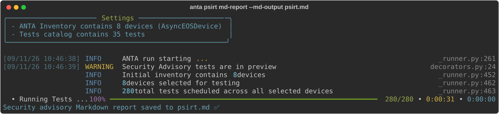
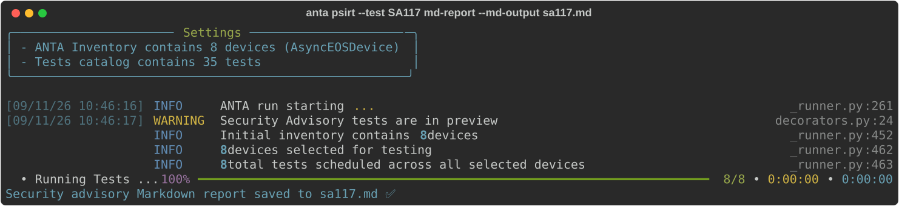

<!--
  ~ Copyright (c) 2026 Arista Networks, Inc.
  ~ Use of this source code is governed by the Apache License 2.0
  ~ that can be found in the LICENSE file.
  -->

!!! warning "Preview"
    The `anta psirt` command is a preview feature. Its interface and behavior may change at any time without a deprecation notice.

!!! info "Report availability"
    JSON, text, and table reports are not currently implemented for `anta psirt`.

The `anta psirt` command runs security advisory tests from the complete built-in
catalog installed with ANTA. It shares inventory options, filters, execution
behavior, and exit handling with [`anta nrfu`](../cli/nrfu.md).

## Command overview

```bash
--8<-- "anta_psirt_help.txt"
```

Provide an inventory and credentials as for NRFU, either with command-line
options or the shared ANTA environment variables. Then select a report format:

```bash
anta psirt md-report --md-output psirt.md
```

{ class="img_center" loading=lazy width="1600" }

By default, the command runs every test registered in the built-in
`anta.tests.advisories` catalog.

All security advisory tests share the same preview warning. ANTA logs
`Security Advisory tests are in preview` once during a command invocation,
regardless of how many advisory tests or devices are selected.

Use `--test` to filter the built-in catalog and run only selected security
advisories. Provide the advisory test class name:

```bash
anta psirt --test SA117 md-report --md-output sa117.md
```

{ class="img_center" loading=lazy width="1600" }

Repeat `--test` to assess multiple selected advisories.

PSIRT-specific execution settings can be configured with
`ANTA_PSIRT_IGNORE_STATUS`, `ANTA_PSIRT_IGNORE_ERROR`, and
`ANTA_PSIRT_DRY_RUN`.

The command accepts the shared ANTA environment variables documented in the
[ANTA CLI overview](../cli/overview.md#anta-environment-variables), except for
the catalog-related variables and `ANTA_DISCONNECT_INVENTORY`. The built-in
security advisory catalog cannot be overridden.

## Reports

Choose Markdown for human review, CSV for automated processing, or a Jinja
template for custom output. See [Security Advisory Reports](reports.md) for a
format comparison, result interpretation, remediation guidance, and the CSV
schema.

!!! warning "Template reports"
    Template reports are intended for advanced customization. Reach out to the ANTA maintainers if you need help creating a template for your use case.

```bash
anta psirt --inventory inventory.yml csv --csv-output sa-report.csv
anta psirt --inventory inventory.yml md-report --md-output sa-report.md
anta psirt --inventory inventory.yml tpl-report --template report.j2 --output sa-report.txt
```

See the [NRFU documentation](../cli/nrfu.md) for shared filters and dry-run
behavior.
