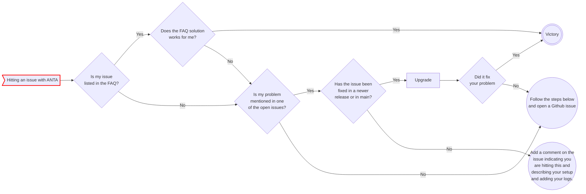

<!--
  ~ Copyright (c) 2024-2025 Arista Networks, Inc.
  ~ Use of this source code is governed by the Apache License 2.0
  ~ that can be found in the LICENSE file.
  -->

A couple of things to check when hitting an issue with ANTA:



## Capturing logs

To help document the issue in Github, it is important to capture some logs so the developers can understand what is affecting your system. No logs mean that the first question asked on the issue will probably be *"Can you share some logs please?"*.

ANTA provides very verbose logs when using the `DEBUG` level.  When using DEBUG log level with a log file, the DEBUG logging level is not sent to stdout, but only to the file.

> [!CAUTION]
> On real deployments, do not use DEBUG logging level without setting a log file at the same time.

To save the logs to a file called `anta.log`, use the following flags:

```bash
# Where ANTA_COMMAND is one of nrfu, debug, get, exec, check
anta -l DEBUG –log-file anta.log <ANTA_COMMAND>
```

See `anta --help` for more information.  These have to precede the `nrfu` cmd.

> [!TIP]
> Remember that in ANTA, each level of command has its own options and they can only be set at this level.
> so the `-l` and `--log-file` MUST be between `anta` and the `ANTA_COMMAND`.
> similarly, all the `nrfu` options MUST be set between the `nrfu` and the `ANTA_NRFU_SUBCOMMAND` (`json`, `text`, `table` or `tpl-report`).

As an example, for the `nrfu` command, it would look like:

```bash
anta -l DEBUG --log-file anta.log nrfu --enable --username username --password arista --inventory inventory.yml -c nrfu.yml text
```

### `ANTA_DEBUG` environment variable

> [!WARNING]
> Do not use this if you do not know why. This produces a lot of logs and can create confusion if you do not know what to look for.

The environment variable `ANTA_DEBUG=true` enable ANTA Debug Mode.

This flag is used by various functions in ANTA: when set to true, the function will display or log more information. In particular, when an Exception occurs in the code and this variable is set, the logging function used by ANTA is different to also produce the Python traceback for debugging. This typically needs to be done when opening a GitHub issue and an Exception is seen at runtime.

Example:

```bash
ANTA_DEBUG=true anta -l DEBUG --log-file anta.log nrfu --enable --username username --password arista --inventory inventory.yml -c nrfu.yml text
```

### Troubleshooting on EOS

ANTA is using a specific ID in eAPI requests towards EOS. This allows for easier eAPI requests debugging on the device using EOS configuration `trace CapiApp setting UwsgiRequestContext/4,CapiUwsgiServer/4` to set up CapiApp agent logs.

Then, you can view agent logs using:

```bash
bash tail -f /var/log/agents/CapiApp-*

2024-05-15 15:32:54.056166  1429 UwsgiRequestContext  4 request content b'{"jsonrpc": "2.0", "method": "runCmds", "params": {"version": "latest", "cmds": [{"cmd": "show ip route vrf default 10.255.0.3", "revision": 4}], "format": "json", "autoComplete": false, "expandAliases": false}, "id": "ANTA-VerifyRoutingTableEntry-132366530677328"}'
```
