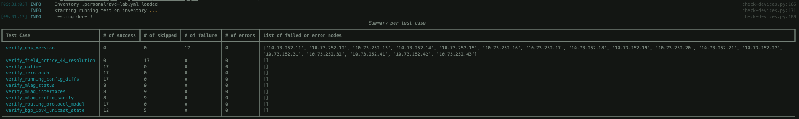

# How to use ANTA scripts


!!! warning "Scripts are now deprecated"
    Please note with [anta cli availability](../usage-anta-cli/), scripts described on this page are now deprecated and will be removed in later release of this project.


ANTA comes with some scripts to leverage network testing immediatly or if you don't want to create your own application. This page describes how to use `check-devices.py` script to run your network testing.

??? note "Create inventory & tests catalog"
    Please visit this [dedicated section](./usage-inventory-catalog.md) for how to use inventory and catalog files.

## Check devices script

The `check-devices.py` script comes with a number of options you can use for the testing. Some are mandatory where some others are optionals.

### Required options

#### Specify inventory and test catalog

There is no default file for inventory and tests catalog, so you have to provide paths in CLI using following triggers:

```bash
check-devices.py -i .personal/avd-lab.yml \
                 -c .personal/ceos-catalog.yml
```

#### Specify username and password

The script needs your credentials to connect to devices and they have to be provided in the CLI directly. So it is easy to execute this script in a CI pipeline by sending secrets using an environment variable.

```bash
check-devices.py -i .personal/avd-lab.yml \
                 -c .personal/ceos-catalog.yml \
                 --username admin \
                 --password admin123
```

#### Specify output format

Since this script can be used for human reporting or within a more complete scenario, user is free to select either `table`, `list` or `json` output format.

```bash
check-devices.py -i .personal/avd-lab.yml \
                 -c .personal/ceos-catalog.yml \
                 --username admin \
                 --password admin123 \
                 --(table|list|json)
```

This `--table` option provides a nice human readable format where `--list` is more a grepable output and `--json` is more to send output to another script

</img>

### Available options

Then, besides the mandatory keys, some options are available such as:

- Tag (`--tag`): to run tests against a subset of your inventory.
- Timeout (`--timeout`): if some devices are not close to your tester, it might be useful to increase response delay.
- Enable Password (`--enable_password`): Allow to configure optional `enable` password required for some tests.
- Run tests for a specific host (`--hostip`)
- Run tests for a specific test (`--test`)

Also, when you use `--table` for output, you can get some report summaries:

- Per host overview (`--by-host`): list number of sucessful, skipped, failed tests and list all failed tests.

</img>

- Per test overview (`--by-test`): list number of sucessful, skipped, failed hosts and list all failed hosts.

</img>

- Save JSON format to a file: use the `--save <path/to/output/file.json>` option.

```bash
# Run testing
check-devices.py -i .personal/avd-lab.yml \
                 -c .personal/ceos-catalog.yml \
                 --username admin \
                 --password admin123 \
                 --(table|list|json)

# Display saved results
head -n 8 demo.json
[
    {
        "host": "10.73.252.11",
        "test": "verify_eos_version",
        "result": "failure",
        "messages": "[\"device is running version 4.27.2F-26069621.4272F (engineering build) not in expected versions: ['4.25.4M', '4.26.1F']\"]"
    },
```
