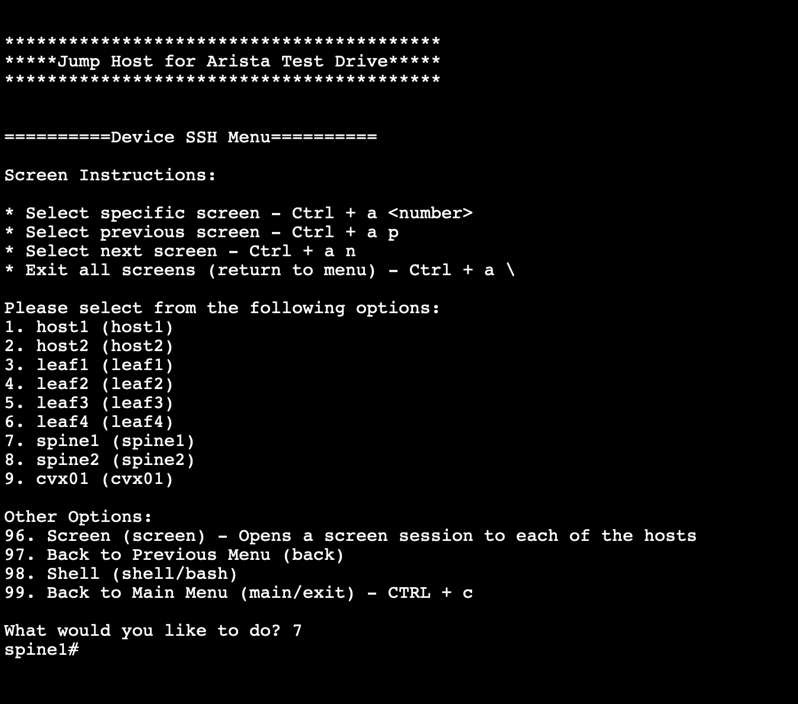

**Table of contents**

- [Set up the lab](#set-up-the-lab)
  - [Set up an ATD instance](#set-up-an-atd-instance)
  - [Load the EVPN lab on ATD](#load-the-evpn-lab-on-atd)
  - [Check the state of spine1](#check-the-state-of-spine1)
  - [Clone the repository on devbox](#clone-the-repository-on-devbox)
  - [Install the requirements on devbox](#install-the-requirements-on-devbox)
  - [Install some additionnal tools on devbox](#install-some-additionnal-tools-on-devbox)
  - [Check the requirements on the switches](#check-the-requirements-on-the-switches)
  - [Check the inventory files](#check-the-inventory-files)
- [Test devices reachability using EAPI](#test-devices-reachability-using-eapi)
- [Test devices reachability](#test-devices-reachability)
- [Test devices](#test-devices)
  - [Run the tests](#run-the-tests)
  - [Fix the issue](#fix-the-issue)
  - [Re run the tests](#re-run-the-tests)
- [Collect commands output](#collect-commands-output)
- [Collect the scheduled show tech-support files](#collect-the-scheduled-show-tech-support-files)
- [Clear the list of MAC addresses which are blacklisted in EVPN](#clear-the-list-of-mac-addresses-which-are-blacklisted-in-evpn)
  - [Create 5 mac moves within 180 seconds](#create-5-mac-moves-within-180-seconds)
  - [Clear the blacklisted MAC addresses](#clear-the-blacklisted-mac-addresses)
- [Clear counters](#clear-counters)

Here's the instructions to use this repository with an ATD (Arista Test Drive) lab.

# Set up the lab 

## Set up an ATD instance

Login to the Arista Test Drive portal, create and start an instance.

Here's the ATD topology:


## Load the EVPN lab on ATD


This lab uses 2 spines and 2 leaves:

- Spine1 and spine2
- Leaf1 and leaf3

Leaf2 and leaf4 are not used.

Here's the EVPN lab topology:


The script configured the lab with the exception of leaf3:

- Leaves <-> spines interfaces are configured with an IPv4 address.
- eBGP is configured between spines and leaves (underlay, IPv4 unicast address family).
- BFD is configured for the eBGP sessions (IPv4 unicast address family)
- 2 loopback interfaces are configured per leaf.
- 1 loopback interface is configured per spine.
- eBGP is configured between spines and leaves (overlay, EVPN address family, Loopback0).
- VXLAN is configured on the leaves (Loopback1)
- Default VRF only.

## Check the state of spine1



```text
spine1#show ip bgp summary
spine1#show bgp evpn summary
spine1#sh lldp neighbors
```

Some BGP sessions are not established because Leaf3 is not yet configured.

## Clone the repository on devbox

Use the devbox shell and clone the repository:


```bash
git clone https://github.com/arista-netdevops-community/network-test-automation.git
cd network-test-automation
```

## Install the requirements on devbox

Run these commands on devbox:

```bash
pip install -r requirements.txt
pip install -r requirements-dev.txt
```

```bash
pip list
```

## Install some additionnal tools on devbox

Run these commands on devbox:

```bash
sudo apt-get install tree
sudo apt install unzip
```

## Check the requirements on the switches

```bash
spine1#show management api http-commands
```

## Check the inventory files

Run these commands on devbox:

```bash
ls demo/inventory
more demo/inventory/all.txt
more demo/inventory/spines.txt
more demo/inventory/leaves.txt
```

# Test devices reachability using EAPI

Start a python interactive session on devbox:

```bash
arista@devbox:~$ python
```

Run these python commands:

```python
from jsonrpclib import Server
import ssl
ssl._create_default_https_context = ssl._create_unverified_context
username = "arista"
# use the device password of your ATD instance
password = "aristaoy21"
ip = "192.168.1.10"
url = "https://" + username + ":" + password + "@" + ip + "/command-api"
switch = Server(url)
result=switch.runCmds(1,['show version'], 'text')
print(result[0]['output'])
exit()
```

# Test devices reachability

Run these commands on devbox:

```bash
./check_devices_reachability.py --help
./check_devices_reachability.py -i demo/inventory/all.txt -u arista
```

# Test devices

## Run the tests 

Run these commands on devbox:

```bash
./check_devices.py --help
```

ATD uses cEOS or vEOS so we will skip the hardware tests.  
This lab doesnt use MLAG, OSPF, IPv6, RTC ... so we will skip these tests as well.  
Some tests can be used for all devices, some tests should be used only for the spines, and some tests should be used only for the leaves.  

```bash
ls demo/inventory
more demo/inventory/all.txt
more demo/inventory/spines.txt
more demo/inventory/leaves.txt
```

```bash
ls demo/tests
more demo/tests/all.yaml
more demo/tests/spines.yaml
more demo/tests/leaves.yaml
```

```bash
./check_devices.py -i demo/inventory/all.txt -t demo/tests/all.yaml -o demo/tests_result_all.txt -u arista
cat demo/tests_result_all.txt
```

```bash
./check_devices.py -i demo/inventory/spines.txt -t demo/tests/spines.yaml -o demo/tests_result_spines.txt -u arista
cat demo/tests_result_spines.txt
```

```bash
./check_devices.py -i demo/inventory/leaves.txt -t demo/tests/leaves.yaml -o demo/tests_result_leaves.txt -u arista
cat demo/tests_result_leaves.txt
```

Some tests failed.  
This is expected because leaf3 is not yet configured.  

## Fix the issue

Lets configure leaf3 using EAPI.

```bash
python demo/configure_leaf3.py
```

## Re run the tests

Lets re run all the tests.

```bash
./check_devices.py -i demo/inventory/all.txt -t demo/tests/all.yaml -o demo/tests_result_all.txt -u arista
./check_devices.py -i demo/inventory/spines.txt -t demo/tests/spines.yaml -o demo/tests_result_spines.txt -u arista
./check_devices.py -i demo/inventory/leaves.txt -t demo/tests/leaves.yaml -o demo/tests_result_leaves.txt -u arista
cat demo/tests_result_all.txt
cat demo/tests_result_spines.txt
cat demo/tests_result_leaves.txt
```

# Collect commands output

Run these commands on devbox:

```bash
./collect_eos_commands.py --help
more demo/eos-commands.yaml
./collect_eos_commands.py -i demo/inventory/all.txt -c demo/eos-commands.yaml -o demo/show_commands -u arista
ls demo/show_commands
tree demo/show_commands
more demo/show_commands/192.168.0.10/text/show\ version
more demo/show_commands/192.168.0.10/json/show\ version
```

# Collect the scheduled show tech-support files

```bash
spine1# sh running-config all | grep tech
spine1# bash ls /mnt/flash/schedule/tech-support/
```

Run these commands on devbox:

```bash
./collect_sheduled_show_tech.py --help
./collect_sheduled_show_tech.py -i demo/inventory/all.txt -u arista -o demo/show_tech
ls demo/show_tech
ls demo/show_tech/spine1
unzip demo/show_tech/spine1/xxxx.zip -d demo/show_tech
ls demo/show_tech/mnt/flash/schedule/tech-support/
ls demo/show_tech/mnt/flash/schedule/tech-support/ | wc -l
```

```bash
spine1# bash ls /mnt/flash/schedule/tech-support/
```

# Clear the list of MAC addresses which are blacklisted in EVPN

```bash
leaf3#show mac address-table 
leaf3#show bgp evpn host-flap
leaf3#show logging | grep EVPN-3-BLACKLISTED_DUPLICATE_MAC
```

## Create 5 mac moves within 180 seconds

Run this command alternately on host1 and host2 in order to create 5 mac moves within 180 seconds:

```bash
bash sudo ethxmit --ip-src=10.10.10.1 --ip-dst=10.10.10.2 -S 948e.d399.4421 -D ffff.ffff.ffff et1 -n 1
```

Leaf1 or leaf3 concludes that a duplicate-MAC situation has occurred (948e.d399.4421)

```bash
leaf3#show mac address-table 
leaf3#show bgp evpn host-flap
leaf3#show logging | grep EVPN-3-BLACKLISTED_DUPLICATE_MAC
```

## Clear the blacklisted MAC addresses

Run this command on devbox to clear on devices the list of MAC addresses which are blacklisted in EVPN:

```bash
./evpn_blacklist_recovery.py --help
./evpn_blacklist_recovery.py -i demo/inventory/all.txt -u arista
```

Verify:

```bash
leaf3#show mac address-table 
leaf3#show bgp evpn host-flap
leaf3#show logging | grep EVPN-3-BLACKLISTED_DUPLICATE_MAC
```

# Clear counters

```bash
spine1#sh interfaces counters
```

Run these commands on devbox:

```bash
./clear_counters.py --help
./clear_counters.py -i demo/inventory/all.txt -u arista
```

```bash
spine1#sh interfaces counters
```
